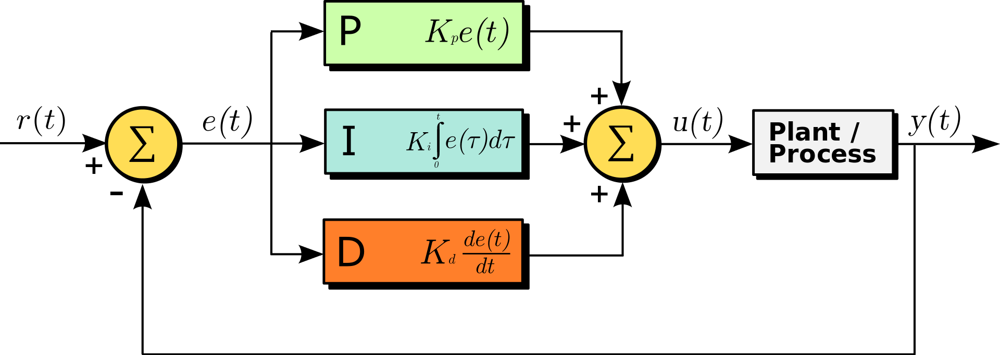

# PIDController.cs


## Example



### In short

```csharp
// KP = 0.2
// kI = 0.01
// KD = 1.0
// control interval = 0.1 sec
PIDController pid_ctrl = new PIDController(0.2, 0.01, 1.0, 0.1);
```

```csharp
double setpoint;// r(t)
double feedback;// y(t)
double output; // u(t)
output = this.pid_ctrl.Update_Once(setpoint, feedback);
```


### Modify PID parameter

```csharp
// void Update_PID(double P, double I, double D)
this.pid_ctrl.Update_PID(P,I,D);
// void Update_Interval(double second)
this.pid_ctrl.Update_PID(second);
```


# _ (┐「ε:) _

